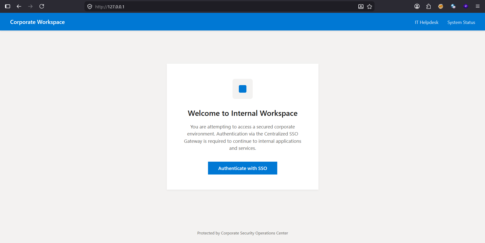
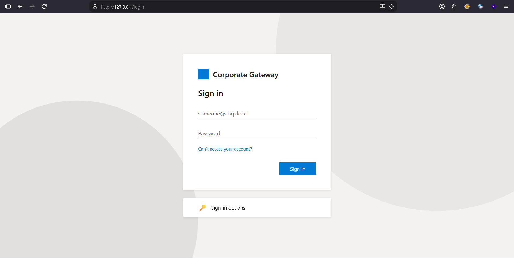
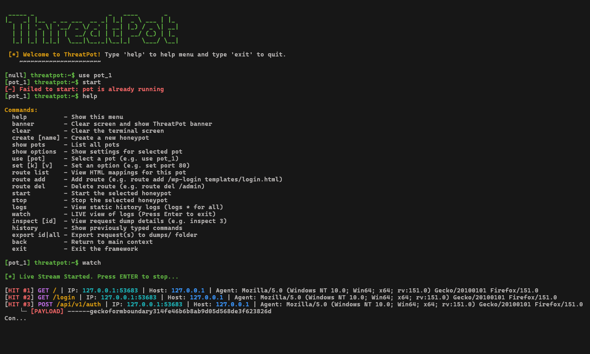

# ThreatPot
ThreatPot is a tactical, high-interaction web honeypot framework written in Go. It is designed to lure attackers into "rabbit holes" by simulating realistic corporate portals and vulnerable backend APIs.

# ScreenShots

### ⚠️ OPSEC WARNING: DO NOT RUN ON BARE METAL

**ThreatPot is a high-interaction honeypot designed specifically to attract, engage, and log malicious traffic.** By design, running this tool means you are intentionally inviting threat actors to attack your network. Exposing ThreatPot to the public internet directly on your host operating system—especially running it as `root` or `Administrator` to bind privileged ports (80/443)—is **highly discouraged**. 

In the event of an unforeseen vulnerability (e.g., a parser bug, memory exhaustion, or a zero-day in the underlying libraries), an attacker could escape the honeypot and achieve Remote Code Execution (RCE) on your host machine.

**Best Practices:**
* **Never run this on your personal or production machines.**
* Always deploy ThreatPot in a strictly isolated environment, such as a dedicated Virtual Machine (VM), a sandboxed container, or an isolated VLAN with no access to your internal network.
* You are solely responsible for the traffic you attract. Use at your own risk.

